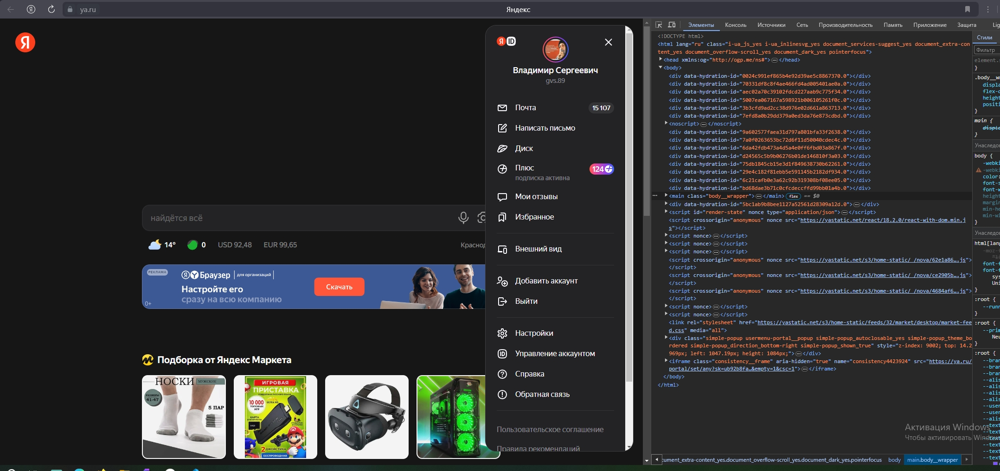

# Урок 2. Семинар. Веб-технологии: вчера, сегодня, завтра
## На основе сайта ya.ru:

### 1. Определите, на каком протоколе работает сайт.
### 2. Проанализируйте структуру страницы сайта
### 3. Внесите не менее 10 изменений на страницу с помощью инструмента разработчика и представьте скриншоты было/стало.
### 4. Создайте прототип низкой детализации.
## Ответы:
### 1. Сайт работает по протоколу HTTPS. Сертификат действителен до 1 сентября 2024 г. файл 
### 2. Cтруктурa страницы сайта ya.ru 
### 3. Изменения с помощью инструмента разработчика ya.ru до 

### 4. Прототип низкой детализации 
